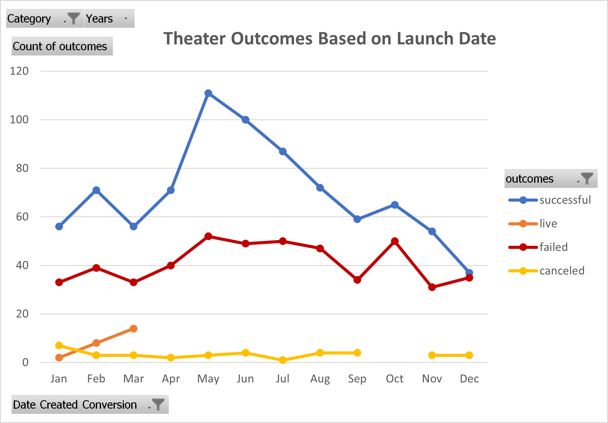
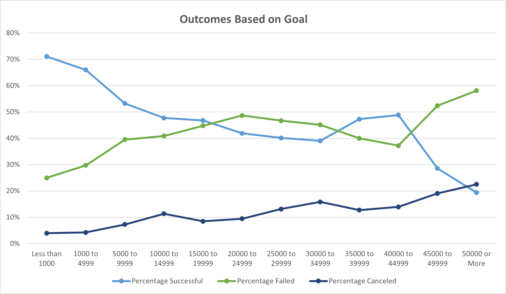

# An Analysis of Kickstarter Campaigns
  Using Excel to visualize Kickstarter campaign outcomes based on a number of criteria. Goal to become more familiar with both basic Excel techniques and more advanced   tools.

## Analysis and Challenges
### Overview
  
  * There are clear patterns in both sets of data. The image above shows outcome totals for each month of the year for all years in which data was collected for theater projects (2009-2017). This monthly aggregate indicates a seasonal trend for theater projects.

  
  * Taking a look at project outcomes based on the amount of money they hoped to raise, there are some predictable trends, with positive correlations between higher goals and the percent of projects failed and canceled. 

* Challenges
  * I had no hiccups when completing the project, but some aspects took longer than others. For example, filling in outcomes based on goal data was a bit tedious as I couldn't copy the formula across cells without adjusting dollar amount parameters (i.e., ">1000", ">5000", etc.), or across columns without adjusting outcome. Otherwise, I thought it was relatively straightforward with clear instructions. I could see COUNTIFS() and the concept of a function with multiple groups of parameters posing difficulty, but having experience with Excel and the use of formulas made it a little easier for me to implement.
  
  
## Results
  
